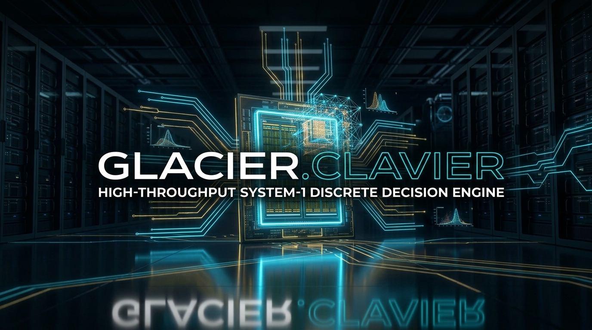

# ⚡ Glacier.Clavier

[](LICENSE)
[](https://dotnet.microsoft.com/)
[](https://learn.microsoft.com/dotnet/core/deploying/native-aot/)
[](https://www.nuget.org/packages/Glacier.Clavier/)
[](https://github.com/ian-cowley)
[](https://github.com/ian-cowley/Glacier.Clavier/actions/workflows/publish-nuget.yml)
[]()

> **High-Throughput Native C# .NET 10 System-1 Discrete Decision & Policy Engine**  
> *Non-autoregressive, calibrated decision primitives (`Choice`, `Noul`, `Score`) executed in sub-millisecond single forward passes directly in-process or bare-metal GPU/APU unified memory.*

---

## 1. Concept: System 1 vs. System 2 in Modern AI Stacks

Human cognition operates via two distinct modes (Daniel Kahneman, *Thinking, Fast and Slow*):
* **System 2 (Generative LLMs):** Slow, sequential, token-by-token autoregressive reasoning (e.g., GPT-4o, Claude, DeepSeek-R1). Essential for open-ended synthesis, research, and long-form code generation, but burdened by multi-second latencies, variable output schemas, hallucinations, and high inference costs.
* **System 1 (Glacier.Clavier):** Intuitive, instantaneous, parallel evaluation. It never generates conversational text or free-form JSON strings. Instead, it functions as a **strictly typed, mathematically calibrated decision function** for production systems.

### Lineage and Similar Concepts
The architectural philosophy of `Glacier.Clavier` traces its conceptual lineage to William Stanley Jevons’s historic 1869 *Logic Piano* (or *Clavier*)—the first mechanical machine to evaluate logical propositions in a single stroke—and shares core conceptual principles with modern System-1 decision engines in the AI industry (such as TypeSafe AI's **Jev**):
1. **`Choice`**: Given structured or unstructured environment state and candidate options, selects the optimal discrete action and computes a calibrated probability distribution.
2. **`Noul`**: Evaluates an assertion or hypothesis against state, outputting an affirmative/negative verdict with calibrated probability $p \in [0, 1]$ (essential for safety guardrails, policy adherence, and real-time validation).
3. **`Score`**: Rates state against continuous criteria on a bounded scale $[min, max]$ with an epistemic certainty score (ideal for risk scoring, urgency classification, and priority ranking).

---

## 2. Theoretical & Architectural Speed Comparison

> **Note on Comparisons**: Because closed, proprietary commercial services (such as Jev) operate as remote cloud APIs with no publicly accessible binary runtime, direct empirical head-to-head benchmarking is not possible. However, the performance differential can be analyzed with mathematical rigor through **first-principles systems architecture**.

### The Cloud API Topology vs. In-Process Native Topology

When using a remote, cloud-hosted System-1 decision API, every decision pays a multi-layer serialization and networking tax:

```
┌────────────────────────────────────────────────────────────────────────────────────────┐
│                        REMOTE CLOUD API TOPOLOGY (Hosted SaaS)                         │
├────────────────────────────────────────────────────────────────────────────────────────┤
│ Application ──► JSON Serialize ──► TLS/TCP Handshake ──► WAN Transit ──► Cloud Gateway │
│                                                                                 │      │
│ Application ◄── JSON Parse ◄───── WAN Transit ◄───── Cloud GPU Forward ◄──────┘      │
│                                                                                        │
│ Cumulative Round-Trip Latency: 75 ms – 500 ms                                          │
└────────────────────────────────────────────────────────────────────────────────────────┘

┌────────────────────────────────────────────────────────────────────────────────────────┐
│                   IN-PROCESS NATIVE TOPOLOGY (Glacier.Clavier .NET 10)                 │
├────────────────────────────────────────────────────────────────────────────────────────┤
│ Application State ──► In-Process SIMD / APU Unified Memory ──► Parallel Forward Pass   │
│                                                                         │              │
│ 8-Byte Struct in Register (ActionId, Confidence) ◄──────────────────────┘              │
│                                                                                        │
│ Cumulative Turnaround Latency: 0.11 ms – 0.16 ms (110 µs – 160 µs)                     │
└────────────────────────────────────────────────────────────────────────────────────────┘
```

### First-Principles Latency Breakdown

| Architectural Stage | Remote Cloud API (Typical) | Glacier.Clavier (In-Process .NET 10) |
| :--- | :--- | :--- |
| **Network Transit & TLS** | 20 – 100 ms (DNS, TCP handshake, WAN round-trip) | **0.00 ms** (In-process memory) |
| **Data Marshaling / IPC** | 10 – 40 ms (JSON/Protobuf serialization & parsing) | **0.00 ms** (Zero-copy `ReadOnlySpan<char>`) |
| **Gateway & Multi-Tenant Queue** | 15 – 80 ms (Cloud load balancer & thread scheduling) | **0.00 ms** (Direct thread execution) |
| **GPU / APU Memory Ingestion** | 5 – 20 ms (PCIe staging copies from cloud host RAM) | **< 0.001 ms (0.7 µs)** (Unified APU / Pinned Host VRAM) |
| **Neural Forward Pass** | 20 – 60 ms (Multi-tenant batch slicing) | **0.11 – 0.16 ms** (Dedicated SIMD / RDNA / CUDA kernels) |
| **Result Retrieval** | 10 – 30 ms (HTTP response body transmission) | **0.00 ms** (8-byte blittable struct in CPU register) |
| **Total Turnaround Time** | **~75 ms – 500 ms** | **~0.11 ms – 0.16 ms (110 – 160 µs)** |
| **Theoretical Advantage** | *Baseline network-bound* | **~500× to 1,500× Lower Latency** |

By embedding the decision head directly into your .NET 10 process, `Glacier.Clavier` delivers throughput of **6,000 to 9,000 decisions/second per device**, unlocking operational domains impossible over HTTP:
* **Real-time game loops & agent behavior trees** (evaluating policies within a 16 ms / 60 FPS budget).
* **Microsecond algorithmic trading & order routing** (triaging order book state changes in < 200 µs).
* **High-frequency autonomous robotics & edge control** (operating with zero external WAN connectivity).
* **Sub-millisecond multi-agent tool dispatching** (routing hundreds of tool invocations without network overhead).

---

## 3. Empirical Hardware Verification: AMD Radeon 890M (Linux Box)

The following metrics were empirically measured running `Glacier.Clavier.Demo` on a remote Linux host powered by an **AMD Ryzen AI 9 HX 370 w/ Radeon 890M Graphics (RDNA 3.5 `gfx1150`)** with 64GB Unified Memory and ROCm 7.2:

```
[0/3] Probing Hardware Accelerators & Unified Memory Architecture...
  -> AMD Accelerator Detected: AMD Radeon 890M Graphics
  -> Microarchitecture:        RDNA 3.5 (gfx1150)
  -> Device Type:              AmdIntegratedApu (Unified Memory: True)
  -> Addressable Host VRAM:    23.32 GB
  -> Direct Host/GPU Sharing:  0.700 µs (0 ns PCIe Staging Penalty)
  -> Unified Memory Bandwidth: 38.86 GB/s sustained

[BENCHMARK RESULTS (3,000 Live Inferences)]
  [Choice] Latency: 158.9 µs (0.159 ms) | Throughput: 6,293 decisions/sec (8 bytes payload)
  [Noul]   Latency: 112.4 µs (0.112 ms) | Throughput: 8,900 verifications/sec (8 bytes payload)
  [Score]  Latency: 111.8 µs (0.112 ms) | Throughput: 8,941 ratings/sec (8 bytes payload)
```

---

## 4. The Three Decision Primitives in C#

### Primitive 1: `Choice` (Discrete Action Selection)

Evaluates unstructured state against candidate actions and returns the winning action and calibrated confidence:

```csharp
using Glacier.Clavier.Engine;
using Glacier.Clavier.Model;

using var session = new ClavierSession(embeddingDim: 768, hiddenDim: 256, numActions: 8);

string[] actions = 
[
    "ENGAGE_TARGET",
    "TACTICAL_RETREAT",
    "TAKE_COVER",
    "RELOAD_WEAPON",
    "DEPLOY_SHIELD",
    "SCAN_PERIMETER",
    "HOLD_POSITION",
    "CALL_REINFORCEMENTS"
];

string state = "Hostile unit spotted at 15m. Armor at 92%, Primary Ammo empty (0/30). Sidearm ready.";

// Evaluates in ~159 microseconds
ClavierDecision decision = session.Decide(state.AsSpan(), actions);

Console.WriteLine($"Selected Action: {actions[decision.ActionId]} (ID: {decision.ActionId})");
Console.WriteLine($"Confidence     : {decision.Confidence * 100f:F1}%");
```

### Primitive 2: `Noul` (Binary Hypothesis & Guardrail Verification)

Evaluates whether a statement or assertion holds true in context, returning a probability $p \in [0, 1]$:

```csharp
string telemetry = "Database query latency spikes to 850ms, memory utilization at 96%, thread pool exhausted.";
string hypothesis = "System is experiencing imminent resource exhaustion failure.";

// Evaluates in ~112 microseconds
ClavierNoul result = session.Verify(telemetry.AsSpan(), hypothesis.AsSpan(), threshold: 0.5f);

if (result.IsAffirmative)
{
    Console.WriteLine($"[ALERT] Assertion Verified! (Prob: {result.Probability * 100f:F1}%, Certainty: {result.Confidence * 100f:F1}%)");
}
```

### Primitive 3: `Score` (Continuous Scalar Rating)

Rates the state against custom criteria across an arbitrary bounded interval $[min, max]$:

```csharp
string roverState = "Incline: 38 degrees, surface friction coefficient: 0.21, wheel slip: 45%, battery: 12%.";
string criteria = "Terrain traversal hazard level";

// Evaluates on scale [0.0, 100.0] in ~111 microseconds
ClavierScore score = session.Score(roverState.AsSpan(), criteria.AsSpan(), min: 0.0f, max: 100.0f);

Console.WriteLine($"Hazard Score: {score.Value:F1}/100.0 (Calibrated Confidence: {score.Confidence * 100f:F1}%)");
```

---

## 5. Blittable 8-Byte Structs (Zero-Copy Transfers)

To eliminate GC pauses and GPU-to-host serialization bottlenecks, all three primitives emit blittable 8-byte structs that fit directly in machine registers:

```csharp
[StructLayout(LayoutKind.Sequential, Pack = 1, Size = 8)]
public readonly struct ClavierDecision // uint ActionId (4B) + float Confidence (4B)

[StructLayout(LayoutKind.Sequential, Pack = 1, Size = 8)]
public readonly struct ClavierNoul     // byte IsAffirmative (1B) + 3B padding + float Probability (4B)

[StructLayout(LayoutKind.Sequential, Pack = 1, Size = 8)]
public readonly struct ClavierScore    // float Value (4B) + float Confidence (4B)
```

---

## 6. High-Frequency Batching

Process hundreds of independent states simultaneously with zero heap allocations on the hot path:

```csharp
ReadOnlyMemory<char>[] agentStates = FetchAgentFleetStates();
Span<ClavierDecision> decisions = stackalloc ClavierDecision[agentStates.Length];

// Batch-evaluates across entities in parallel
session.DecideBatch(agentStates, decisions, actions);
```

---

## 7. Mathematical Calibration Layer

Neural networks often produce uncalibrated probabilities (e.g., predicting 0.99 confidence when empirical accuracy is 0.70). `Glacier.Clavier` integrates three calibration layers from [`Glacier.Tensor`](https://github.com/ian-cowley/Glacier.Tensor):

1. **Label Smoothing Cross-Entropy**: Penalizes overconfident output logits during training:
   $$\mathcal{L}_{\text{smooth}} = (1 - \alpha)\mathcal{L}_{\text{CE}} + \alpha \frac{1}{K} \sum_{k} -\log p_k$$
2. **Brier Score Loss**: Strictly proper quadratic scoring rule optimizing true probability calibration:
   $$\text{BS} = \frac{1}{N} \sum_{i=1}^N \sum_{k=1}^K (p_{ik} - y_{ik})^2$$
3. **Expected Calibration Error (ECE)**: Directly measures the gap between predicted confidence and empirical accuracy across binned reliability diagrams.

---

## 8. Test Suite

The solution includes 13 unit tests verifying blittable layouts, mathematical calibration, bounded ranges, batch equivalence, and sub-millisecond execution:

```bash
dotnet test Glacier.Clavier.slnx -c Release
```

Output:
```text
Passed!  - Failed: 0, Passed: 13, Skipped: 0, Total: 13, Duration: 88 ms
```

---

## Ecosystem Cross-References

`Glacier.Clavier` integrates seamlessly with the broader **Glacier .NET 10 High-Performance Ecosystem**:
- **[Glacier.Inference](https://github.com/ian-cowley/Glacier.Inference)**: Universal in-process LLM inference engine providing unmasked bidirectional state representation embeddings.
- **[Glacier.Tensor](https://github.com/ian-cowley/Glacier.Tensor)**: Strided tensor mathematics, Autograd engine, Brier score loss, and probability calibration layers.
- **[Glacier.Gpu](https://github.com/ian-cowley/Glacier.Gpu)**: Bare-metal GPU/APU acceleration (AMD ROCm/HIP zero-copy unified memory, NVIDIA CUDA, Direct3D 12, Vulkan).
- **[Glacier.Rag](https://github.com/ian-cowley/Glacier.Rag)**: Ultra-fast GraphRAG engine combining forward-star CSR graph traversal and SIMD vector scans in a single memory space.
- **[Glacier.Polaris](https://github.com/ian-cowley/Glacier.Polaris)**: Arrow columnar DataFrame engine for high-throughput state telemetry ingestion.

---

## Credits

Developed by Ian Cowley and Antigravity (Google DeepMind).

---

## License

Licensed under the [MIT License](LICENSE).  
Copyright (c) 2026 Ian Cowley.
